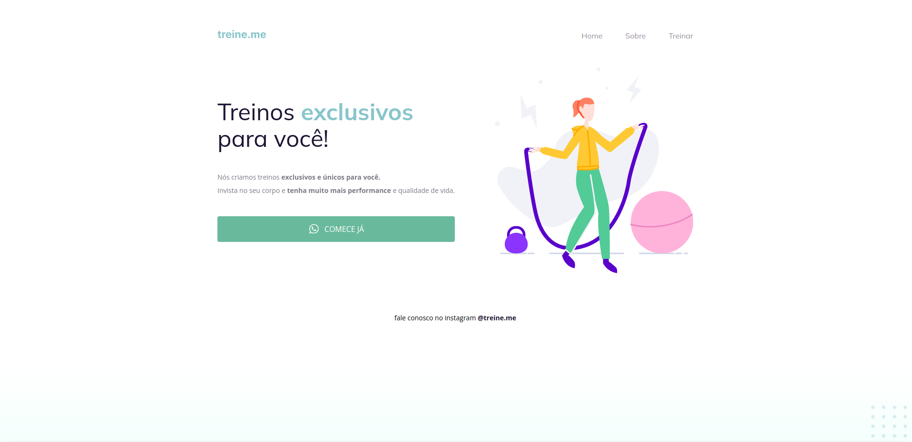

<h1 align="center"> 🚀👨🏼‍🚀 #Desafio Rocketseat - Intermediário
    👨🏼‍💻Semântica & Acessibilidade 👀</h1>

  <a href="#-projeto">Projeto</a>&nbsp;&nbsp;&nbsp;|&nbsp;&nbsp;&nbsp;
  <a href="#-tecnologias">Tecnologias</a>&nbsp;&nbsp;&nbsp;&nbsp;&nbsp;&nbsp;

 

## 💻 Projeto

Como você pode ver na imagem abaixo, a página (exceto o botão) continua funcionando normalmente,porém os elementos HTML estão todos desorganizados...👀
 Esse projeto consiste em um desafio do Explorer da Rocketseat,onde devemos consertar  a semântica e à acessibilidade dos elementos HTML do
[projeto-02-explorer](https://github.com/PabloPerdigao/Projeto-02-Explorer),que sofreu algumas alterações e está todo bagunçado.

  

## 🚀 Tecnologias

Esse projeto foi desenvolvido com as seguintes tecnologias:

- HTML e CSS
- Git e Github

---

😉 Feito com ♥ by Pablo Perdigão,aluno Explorer da Rocketseat!
 📲 [Participe da comunidade Rocketseat!](https://discord.gg/rocketseat)
